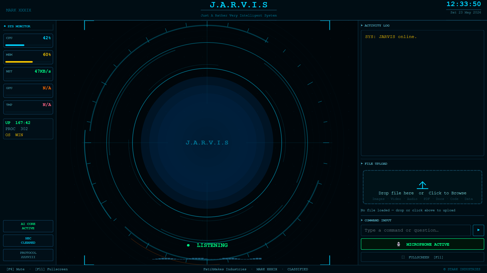

# 🤖 Jarvis AI Assistant

An advanced AI-powered desktop voice assistant built with Python.  
Jarvis can perform voice commands, open applications, automate tasks, interact with AI models, and provide a futuristic assistant experience with a modern UI.

---

# ✨ Features

- 🎤 Voice Recognition
- 🗣️ Text-to-Speech Response
- 💻 Open Desktop Applications
- 🌐 Open Websites
- 📂 File & Folder Access
- 🤖 AI Chat Integration
- 📸 Camera Access
- 🔋 System Control Commands
- 🎵 Play Music
- 🧠 Smart Command Processing
- 🎨 Modern Jarvis UI
- ⚡ Fast Response System

---

# 📸 Screenshots



# 🛠️ Technologies Used
```md
Python
PyQt5 / PyQt6
SpeechRecognition
pyttsx3
OpenAI / OpenRouter API
Selenium
PyAudio
Requests
Threading
Automation Libraries
```

# 📂 Project Structure
```md
Jarvis-AI-Assistant/
│
├── assets/
├── config/
├── ui/
├── main.py
├── requirements.txt
├── README.md
└── .gitignore
```

# 🚀 Installation

1️⃣ Clone Repository
```md 
git clone https://github.com/P2786/Jarvis-AI-Assistant.git
 ```

2️⃣ Open Project Folder
```md 
cd Jarvis-AI-Assistant
```

3️⃣ Create Virtual Environment
```md 
python -m venv venv
```

Activate Environment:

Windows
venv\Scripts\activate
Linux / Mac
source venv/bin/activate

4️⃣ Install Requirements
```md 
pip install -r requirements.txt
```

▶️ Run Project
```md 
python main.py
```

# 🔑 API Configuration

Create your API configuration file:

config/api_keys.json

Example:

```md
{
  "openrouter": "YOUR_API_KEY"
}
```

⚠️ Never upload real API keys to GitHub.

# 🎙️ Example Commands
```md
"Open Chrome"
"Open YouTube"
"What is the time?"
"Play music"
"Open camera"
"Shutdown system"
"Search Google"
```
# 📦 Requirements
Generate requirements file using:

pip freeze > requirements.txt

# 🔒 Security

This project uses local configuration files for API keys.
Always keep sensitive credentials private.

# 🌟 Future Improvements
Face Recognition Login
ChatGPT Integration
Custom Wake Word
Home Automation
Mobile App Control
Offline AI Model Support
Smart Memory System

# 👨‍💻 Developer

Pramit Savaliya

# GitHub:
```md https://github.com/P2786 ```

📜 License

This project is for educational and personal use.
